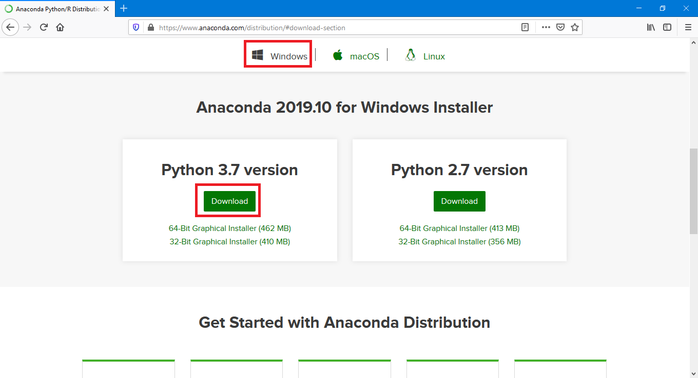
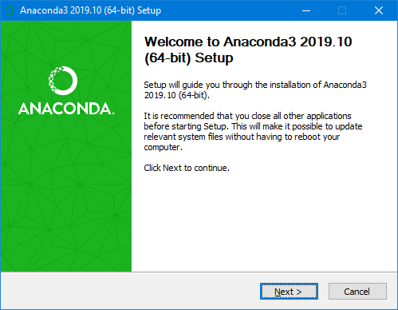
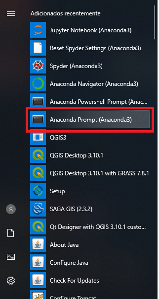

# Instalação do Anaconda 3 | Microsoft Windows

Esta página apresenta os passos para a instalação do ambiente [Anaconda 3](https://docs.anaconda.com/anaconda/), uma plataforma voltada para o gerenciamento de ambientes de execução para análise de dados, suportando linguagens como Python e R.

> Os passos realizados neste documento foram feitos no Microsoft Windows 10, mas estes podem ser realizados em versões anteriores do sistema operacional. Para saber mais consulte a [documentação do Anaconda](https://docs.anaconda.com/anaconda/install/windows/)

Para iniciar a instalação, acesse a [página de *download* do Anaconda](https://www.anaconda.com/distribution/#download-section), uma distibuição do Python voltada para a análise de dados, neste os principais pacotes já estão configurados e prontos para uso.

    

Na página de *download*, faça a seleção da versão de `Windows` e então baixe a versão do Python 3.7

Após finalizar o *download*, execute o arquivo baixado para iniciar a instalação.

    

Diversas opções serão exibidas durante a instalação, recomenda-se manter todos os parâmetros padrão, com exceção da seleção da opção `Register Anaconda as my default Python 3.7`. É importante esta opção ser marcada.

> Note que, a opção `Add Anaconda to my PATH environment variable` deve ser evitada, ela pode trazer problemas para outros programas em seu sistema

No final da instalação os utilitários de execução do Anaconda já estarão disponível. Faça a execução do `Anaconda Prompt (Anaconda3)`, este será utilizado para a instalação dos pacotes utilizados no curso.

    

Com o terminal aberto, acesse a página de configuração dos ambientes R e Python, e faça suas configurações.

- [Configuração do ambiente R](config-env-r.md)
- [Configuração do ambiente Python](config-env-python.md)
