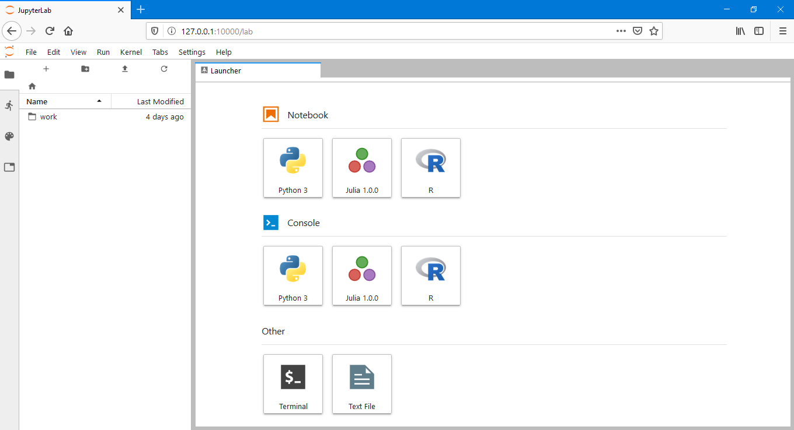

# Configuração do ambiente via Docker

Esta página apresenta as etapas para a configuração do ambiente do curso através do Docker

> Os passos apresentados podem ser utilizados em qualquer plataforma, sendo que para Linux e MacOS os comandos são os mesmos e para o Windows a mudança está no diretório de dados.

Inicialmente faça o *download* da imagem utilizada

```shell
sudo docker pull m3nin0/geospatial-notebook:latest
```

> O comando sudo deve ser utilizado apenas no Linux

Com a imagem baixada, faça a execução do container

```shell
sudo docker run --name notebook-curso-inpe -d -p 12000:8888 -v "${PWD}":/home/jovyan/work m3nin0/geospatial-notebook:latest
```

> Note que para o Windows o comando `"${PWD}"` não estará disponível, sendo necessário configurar algo como:  C:\ambiente_curso:/home/jovyan/work

Agora acesse o log do container e recupere o token para login:

```shell
sudo docker logs notebook-curso-inpe
```

A saída será algo como

```
Container must be run with group "root" to update passwd file
Executing the command: jupyter notebook
[I 00:56:07.309 NotebookApp] Writing notebook server cookie secret to /home/jovyan/.local/share/jupyter/runtime/notebook_cookie_secret
[I 00:56:07.760 NotebookApp] JupyterLab extension loaded from /opt/conda/lib/python3.6/site-packages/jupyterlab
[I 00:56:07.760 NotebookApp] JupyterLab application directory is /opt/conda/share/jupyter/lab
[I 00:56:07.764 NotebookApp] Serving notebooks from local directory: /home/jovyan
[I 00:56:07.764 NotebookApp] The Jupyter Notebook is running at:
[I 00:56:07.764 NotebookApp] http://(d9e58d535280 or 127.0.0.1):8888/?token=ece6965312747f20e2dd2ed3b61f6d404e1a08607bdd51db
[I 00:56:07.764 NotebookApp] Use Control-C to stop this server and shut down all kernels (twice to skip confirmation).
[C 00:56:07.765 NotebookApp] 
    
    Copy/paste this URL into your browser when you connect for the first time,
    to login with a token:
        http://(d9e58d535280 or 127.0.0.1):8888/?token=ece6965312747f20e2dd2ed3b61f6d404e1a08607bdd51db
```

Desta saída, copie o token e complete a URL para utilizar o notebook:

`
http://127.0.0.1:12000/?token=SEU_TOKEN_AQUI
`
Depois de trocar o texto `SEU_TOKEN_AQUI` pelo token recuperado, copie o link e insira no navegador.

Ao acessar o navegador ,já será possível ver o ambiente, como apresentado abaixo, pronto para uso.

<p align="center">
    
</p>

Feito! Você está pronto para fazer anaĺise de dados
