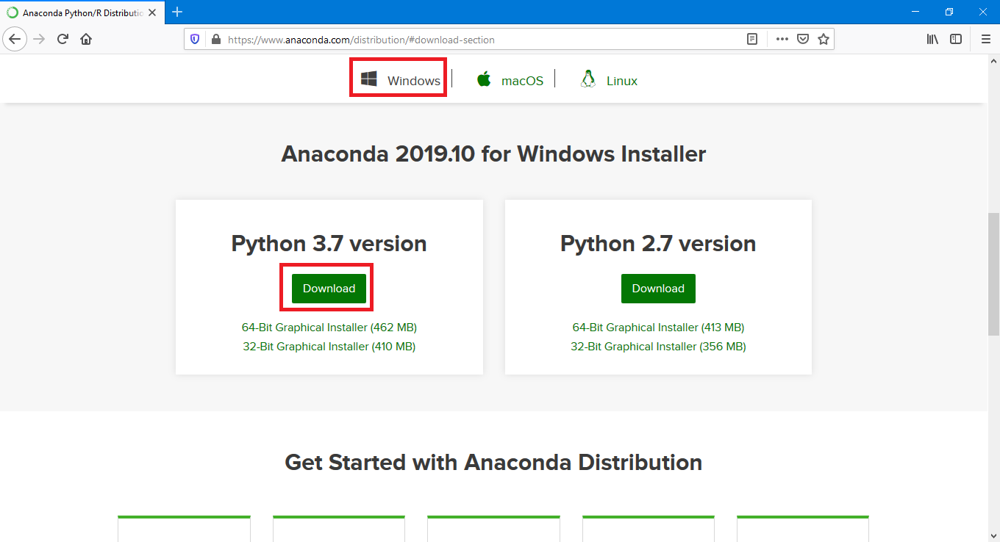
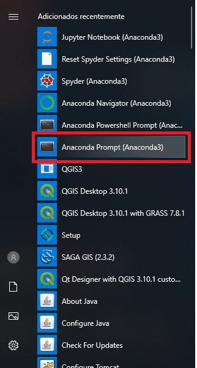

# Instalação do Python no Windows

Esta página apresenta os passos para a realização da instalação do ambiente Python no Sistema Operacional Windows 10.

> Os passos realizados neste tutorial foram feitos no Windows 10, mas é possível reproduzir os mesmos passos 
em versões anteriores

Para iniciar a instalação, acesse a [ página de *download* do Anaconda](https://www.anaconda.com/distribution/#download-section), uma distibuição do Python voltada para a análise de dados, neste os principais pacotes já estão configurados e prontos para uso.

<p align="center">
    
</p>

Na página de *download*, faça a seleção da versão de `Windows` e então baixe a versão do Python 3.7

Após finalizar o *download*, execute o arquivo baixado para iniciar a instalação.

<p align="center">
    
</p>

Diversas opções serão exibidas durante a instalação, recomenda-se manter todos os parâmetros padrão, com exceção da seleção da opção `Register Anaconda as my default Python 3.7`. É importante esta opção ser marcada.

> Note que, a opção `Add Anaconda to my PATH environment variable` deve ser evitada, ela pode trazer problemas para outros programas em seu sistema

No final da instalação os utilitários de execução do Anaconda já estarão disponível. Faça a execução do `Anaconda Prompt (Anaconda3)`, este será utilizado para a instalação dos pacotes utilizados no curso.

<p align="center">
    
</p>

Ao abrir o terminal digite o seguinte comando para a instalação dos pacotes necessários:

```shell
conda install geopandas descartes
```

Ao executar o comando, o ambiente começará a carregar e será necessário aceitar que os pacotes sejam baixados.

<p align="center">
    
</p>

Pronto! Ao término deste processo seu ambiente Python estará pronto para ser utilizado para análise de dados.
